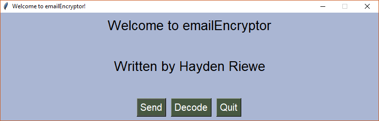
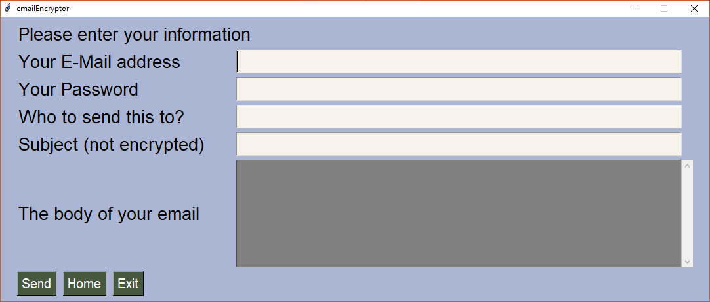

# emailEncryptor (v 2.0)

A simple program to encode and decode Gmail messages.
Currently, it uses my special implementation of a rotation cipher to encrypt your message.
Anybody who sees these encrypted messages will see a bunch of giberish which will be uncrackable
to most. The encryption is done by the program so your original message is NEVER transported over the network. This makes it secure from Man in the Middle attacks and network sniffing.

## Set up
If you are trying to send encrypted messages, I do not suggest using your primary email account.
You can, and it will work, but you will need to alter some settings for the program to work.
I suggest creating a new Gmail account with a strong password, and using that for sending and
recieving messages with emailEncryptor.

In order to send mail through Gmail, you will have to "enable less secure apps"
To do this, click [Here](https://www.google.com/settings/security/lesssecureapps) or follow these steps:
1. Navigate to your Google account settings
2. In the "Sign in and Security pane", click "Apps with account access"
3. Set the "Allow less secure apps" slider to ON

Also, the program will not work if you have "2 step verification" enabled on your account

NOTE: Gmail WILL send you a critical security alert email. You can ignore this.

You will need python.
If you dont have python installed, you can get it [here](https://www.python.org/downloads/)

Thats it! You can now send mail through emailEncryptor

## How to run the program (WITH GUI)
Download the needed modules with:

`pip3 install yagmail`

`pip3 install pysimplegui`

`pip3 install steg`

Run this command on your command line to install the program:

`git clone https://github.com/hriewe/emailEncryptor.git`

CD into the emailEncryptor folder:

`cd emailEncryptor/`

Run the program with:

`python3 GUI.py`

## How to run the program (ON COMMAND LINE)

Install the needed module with:

`pip3 install yagmail`

Run this command on your command line to install the program:

`git clone https://github.com/hriewe/emailEncryptor.git`

CD into the emailEncryptor folder:

`cd emailEncryptor/`

Run the program with:

`python emailEncryptor.py`

If you have multiple different versions of python installed on your machine, you might need to run:

`python3 emailEncryptor.py`

And if you're like me and have multiple different versions of Python 3 installed, you may have to include
your specific version number when you run the program. For me, I have yagmail installed on Python 3.6 so I would run:

`python3.6 emailEncryptor.py`

## How to use Steganography in emailEncryptor

emailEncryptor now comes with a second cipher that will allow you to hide your message inside the pixel data of an image.
To use this cipher, select it inside the program and then when prompted select a png image to hide your message in. For ease
of use a default png image is included "bird.png". You can use your own image if you'd like but make sure it is of PNG format.
When recieving a steg image download it to your computer in the emailEncryptor folder and select it when decoding.

## Notes
* This program is intended to be used by two people to send and decode encrypted messages. When using the program, you can
send mail to anybody without them having to change any setting in their email accounts, but they will not be able to decode
the message without my program. Spread the word and try it out with your friends! Even if you have nothing to hide ;)

* This program will ask you for your gmail username and password. These are not stored anywhere, but if
you do not feel safe, do not enter your information. (There is no practicle way around this, as yagmail needs to be
able to access your account in order to send mail for you)

* Using my program? Let me know!! Send an encrypted email to hriewe13@gmail.com and I will get back to you! 

* [Yagmail Documentation](https://media.readthedocs.org/pdf/yagmail/latest/yagmail.pdf)

* [PySimpleGUI Documentation](https://pysimplegui.readthedocs.io/)

## Coming Soon

* Image support! (Distorting images to the point where no one can tell what they were, and then reversing that inside the program)

### Update Notes
* Version 2 is here! The rotation cipher has been tremendously updated and is now much more secure. A new cipher has been added (Steganography) that allows you to hide your message in the pixel data of an image. The code has been restructured completely. Plus much more!

* emailEncryptor now hides the key behind the same encryption as the rest of the messsage. The user simpily pastes in their message and the program will extract the key and decode accordingly.

* emailEncryptor now runs with a user friendly GUI. The version here is optimized to run on a Mac machine, but it will work for any. If you find a bug with the program on your machine, please let me know so I can fix any problems.
